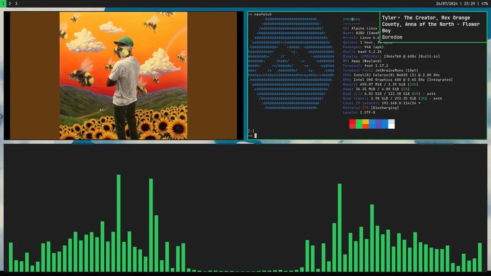

# Minhas dotfiles

Bom, eu sou um ricer preguiçoso, mas ainda assim gosto de fazer algo
minimamente agradável.

Se você (de alguma forma) achar essas configurações interessantes, pode usar a
vontade.

